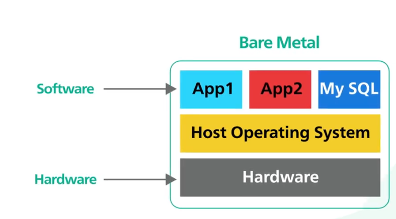
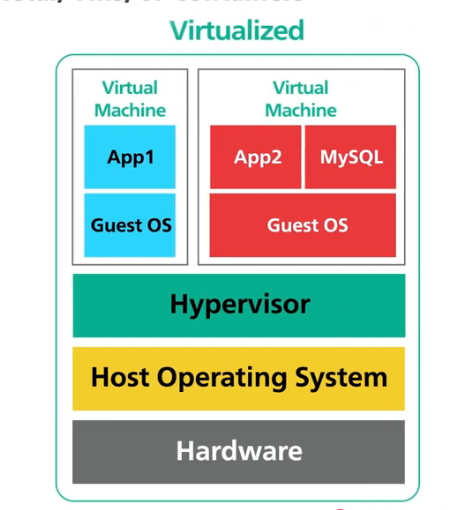
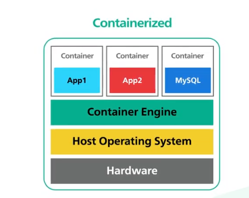

- [Servers - Bare metal, virtual machines (VMs)](#servers)
- [Containers - Docker, Kubernetes, container orchestration](#containers)
- [Serverless - AWS Lambda, Azure Functions, Google Cloud Functions](#serverless)
- [FaaS - Function-as-a-Service](#faas)
- [PaaS - Platform-as-a-Service](#paas)

### Servers

[BareMetal VMS](https://www.youtube.com/watch?v=Jz8Gs4UHTO8)

`Bare Metal`:

- Dedicated physical servers
- High performance, full control
- Higher cost, less flexibility
- 

`Benefits of Bare Metal Servers`:

- High performance for resource-intensive applications
- Full control over hardware and software configurations
- Enhanced security and isolation
- Suitable for legacy applications that require specific hardware

`Virtual Machines (VMs)`:

- Software emulation of physical servers
- Run multiple VMs on a single physical server
- More flexible, easier to manage
- Overhead from hypervisor, less performance than bare metal
- 

- What is Virtualization?
- [Virtulaization](https://youtu.be/UBVVq-xz5i0?si=x1BdcJQeyR2mTfmb)
- Virtualization is process of simulating hardware and software inside a virtual environment, allowing multiple virtual machines to run on a single physical server, with benefits such as improved resource utilization, isolation, and flexibility.
- Creation of virtual versions of physical resources
- Enables multiple virtual machines to run on a single physical server
- Benefits include improved resource utilization, isolation, and flexibility

- `What is a Hypervisor?`
  - Software layer that enables `virtualization`
  - Types: Type 1 (bare-metal), Type 2 (hosted)
  - Examples: VMware ESXi, Microsoft Hyper-V, KVM, Xen
  - Hypervisor manages resource allocation, isolation, and communication between VMs and physical hardware

- `What is Bare Metal Hardware?`
  - Physical servers without virtualization
  - Dedicated resources for a single tenant
  - Used for high-performance workloads, legacy applications, or when full control is required

`Benefits of Virtual Machines`:`

- Isolation between applications
- Efficient resource utilization
- Easier backup and recovery
- Flexible deployment options

`Disadvantages of Virtual Machines`:

- Performance overhead due to hypervisor
- Higher resource consumption compared to containers, more disk-space, RAM, CPU
- Longer startup times compared to containers, because VMs have their own OS, while containers share the host OS

### Containers

- [VMs vs Containers](https://www.youtube.com/watch?v=eyNBf1sqdBQ)
- 

- Containers are lightweight, portable, and share the host OS kernel, while VMs are heavier and run their own OS, containers share the host OS kernel.
- Example of containerization: Docker, Kubernetes.

- `What is a Container?`
- A container is a lightweight, standalone, executable package that includes everything needed to run a piece of software, including the code, runtime, system tools, libraries, and settings. Containers share the host operating system kernel, allowing for efficient resource utilization and fast startup times.

- `What is the Container Engine?`
- A Container Engine unpacks the container image, sets up the container environment, and runs the containerized application. Examples include Docker Engine and containerd.

`- Benefits of Containers:`

- Fast startup times
- Efficient resource utilization
- Portability across environments
- Ideal for microservices and cloud-native applications

- `Disadvantages of Containers:`
  - Containers must be packaged to same OS ,as thatof the Host OS, while VMs can run different OS on the same physical server, because they have their own OS. Hence the containers are Linux based or Windows based.
  - Less isolation compared to VMs, since they share the host OS kernel
  - Security concerns due to shared kernel
  - Not suitable for applications that require full OS features or specific kernel versions

  - `NOTE`: We can also deploy Docker containers inside VMs, to get the benefits of both technologies, such as better isolation and security from VMs, and faster startup times and efficient resource utilization from containers.

### Serverless

- [What is Serverless?](https://youtu.be/rqoVz81ARzA?si=leHThi-Tlv9Sd-I3)
  - With physical servers and VMs, you have to manage the underlying infrastructure, including provisioning, scaling, OS, Patches,and maintenance. With serverless, the cloud provider takes care of all infrastructure management tasks, allowing developers to focus solely on writing code.

  `Key Characteristics of serverless include:`
  - Event-driven execution: Serverless functions are triggered by events, such as HTTP requests, database changes, or scheduled timers.
  - Automatic scaling: Serverless platforms automatically scale the number of function instances based on incoming traffic, ensuring optimal performance without manual intervention.
  - Pay-as-you-go pricing: With serverless, you only pay for the actual execution time of your functions, rather than for idle resources, making it cost-effective for applications with variable workloads.
  - Statelessness: Serverless functions are typically stateless, meaning they do not maintain any persistent state between executions. This allows for better scalability and fault tolerance, as functions can be easily replicated across multiple instances.

  - Serverless functions are often delivered as Function-as-a-Service (FaaS), where developers write individual functions that are executed in response to specific events. Examples of serverless platforms include `AWS Lambda`, `Azure Functions`, and `Google Cloud Functions`, `Cloudflare Functions`, `Vercel Serverless Functions`, and `Netlify Functions`.

  Warm Start vs Cold Start:
  - Warm Start: When a serverless function is invoked and there is already an instance available to handle the request, resulting in faster response times.
  - Cold Start: When a serverless function is invoked and there are no available instances, causing the platform to spin up a new instance, which can lead to increased latency for the initial request.

  `Disadvantages of Serverless:`
  - Cold start latency can impact performance for infrequently used functions.
  - Limited control over the underlying infrastructure and runtime environment.
  - Not suitable for long-running processes or applications with high resource requirements.
  - Vendor lock-in, as applications may become tightly coupled to specific serverless platforms and their APIs. Example: AWS Lambda functions may rely on AWS-specific services and features, making it difficult to migrate to another cloud provider without significant code changes.
  - Debugging and monitoring can be more complex in serverless environments due to the distributed nature of functions and lack of access to underlying infrastructure logs and metrics.

### FaaS
[FaaS - Function-as-a-Service](https://www.youtube.com/watch?v=M--5UlkNAl0)
- Function-as-a-Service (FaaS) is a cloud computing model that allows developers to write and deploy individual functions that are executed in response to specific events, without the need to manage the underlying infrastructure. FaaS is a key component of serverless computing, where the cloud provider takes care of all infrastructure management tasks, allowing developers to focus solely on writing code.

### PaaS
[PaaS - Platform-as-a-Service](https://www.youtube.com/watch?v=wGv2WmONRkE)
- Platform-as-a-Service (PaaS) is a cloud computing model that provides a complete development and deployment environment in the cloud, allowing developers to build, test, and deploy applications without worrying about the underlying infrastructure. PaaS typically includes tools for application development, database management, middleware, and runtime environments, enabling developers to focus on writing code and delivering features rather than managing servers and infrastructure. Examples of PaaS providers include `Heroku`, `Google App Engine`, `Microsoft Azure App Service`, and `AWS Elastic Beanstalk`.